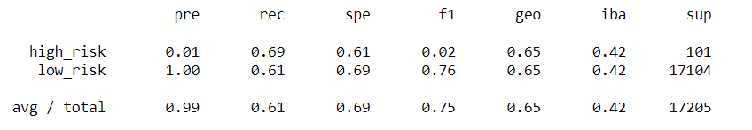
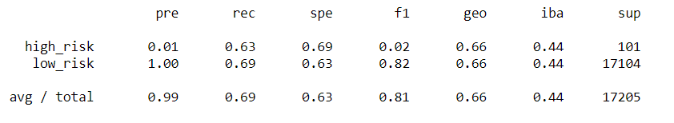
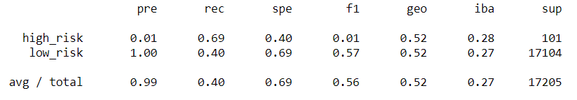
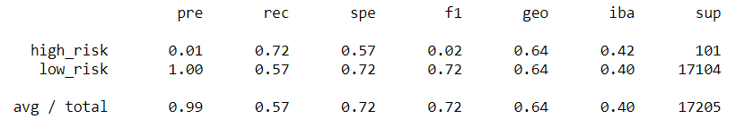
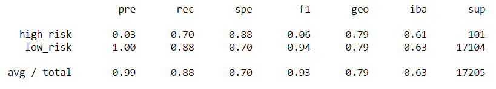
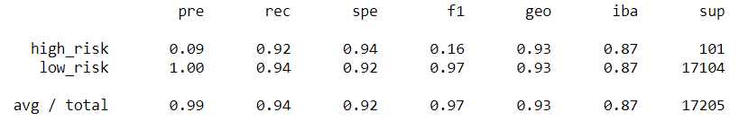

# Credit_Risk_Analysis

## Overview
Determine the best suited machine learning model on a dataset of credit card credit from Lending Club. The model will be use to make predictions on which records will be a credit risk. The learning techniques to train and evaluate models will come from the imbalanced-learn and skikit-learn libraries.

## Results
Six learning techniques were implemented: Random Over Sampler, SMOTE, Cluster Centroids, SMOTEENN, Balanced Random Forest Classifier, and Easy Ensemble AdaBoost Classifier.  
* Random Oversampling resulted in a balanced accuracy score of 0.65.  
  

* SMOTE resulted in a balanced accuracy score of 0.66.  
  

* Cluster Centroids resulted in a balanced accuracy score of 0.54.  
  

* SMOTEENN resulted in a balanced accuracy score of 0.65.  
  

* Balanced Random Forest Classifier resulted in a balanced accuracy score of 0.79.  
  

* Easy Ensemble AdaBoost Classifier resulted in a balanced accuracy score of 0.93l
  

## Summary
SMOTE had the best accuracy score amongst the resampling techniques. However at 0.66 score, this would be considered less than moderate. We achieve a higher score when using the ensemble learning models with Easy Ensemble AdaBoost Classifier having the highest accuracy score of 0.93. Even though AdaBoost had the best scores in all calculations of precision, recall, and F1 amongst the other models, the precision and F1 scores are extremely low which results in having high false positives. Therefore, we cannot recommend using any models here. We could explore other models that could be benefical such as gradient boosting since boosting shown better results than all the other techniques.  